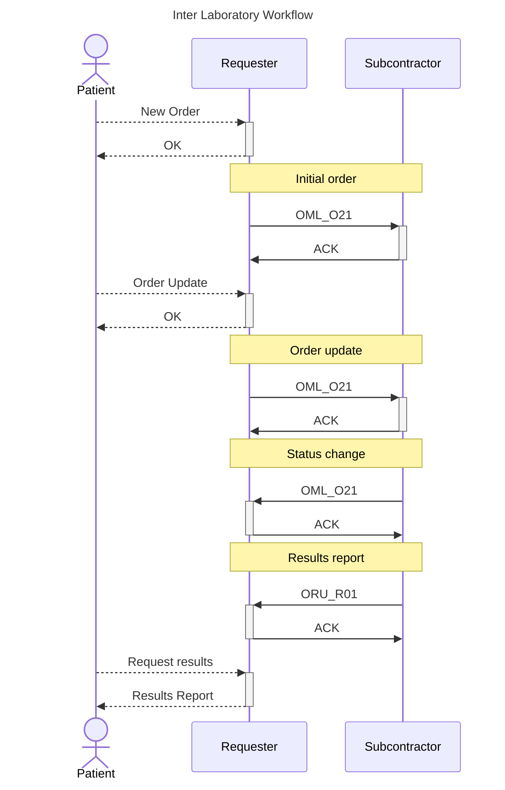

# Abstract

This project aims to demonstrate the integration of third-party products with the laboratory information system iLab. **The integration is event-driven**, based on the HL7 v2.5.1 standard.

We will strictly follow recommendations of [IHE](https://www.ihe.net/). The relevant IHE workflow is [Inter Laboratory Workflow (ILW)](https://www.ihe.net/uploadedFiles/Documents/Laboratory/IHE_LAB_Suppl_ILW.pdf), transactions **LAB-35** and **LAB-36**.

LIS iLab may be used both as **Requester** and **Subcontractor**. In many scenarios, it will cover both roles simultaneously with many partner organizations.

## Inter Laboratory Workflow

Here is the exemplary diagram of the workflow.

