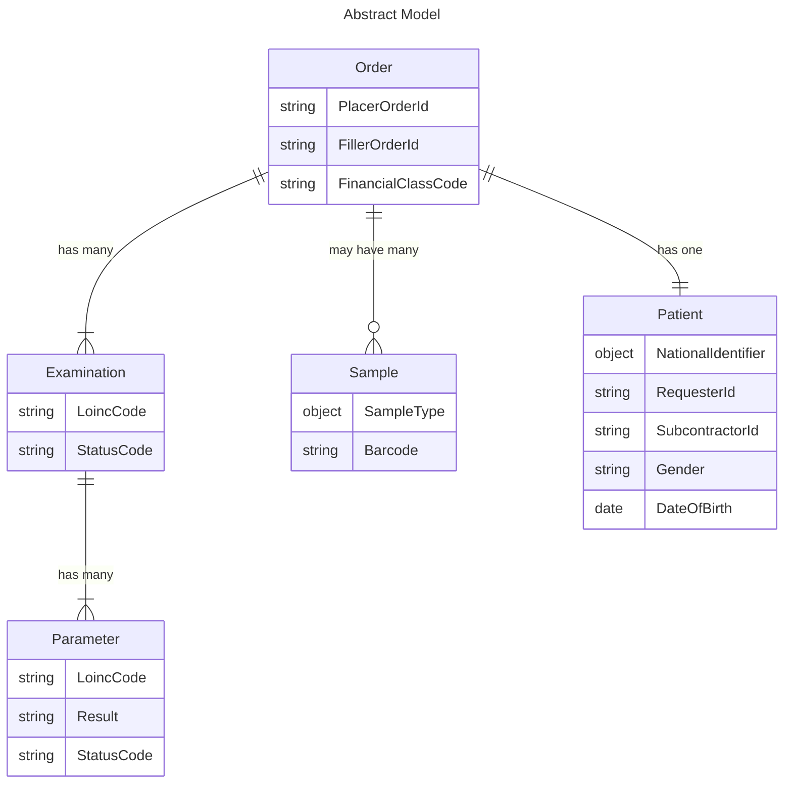

# Abstract Model

The subject of whole the workflow is **Order**. This chapter describes structure and key properties of the order. Below is the ER model of this entity.

## Order

Order is the main object in this workflow. The relevant segments with information about order are *ORC* and *PV1*. Its key properties are:

| Property  | Description  | HL7 filed  |
|---|---|---|
| PlacerOrderId  | Identifier of the order as it is known in Requester's system  | ORC.2  |
| FillerOrderId  | Identifier of the order as it is known in Subcontractor's system  | ORC.3  |
| FinancialClassCode | This is the code that identifies sources of reimbursement, e.g. insurance type, corporate contract, self-reimbursement, etc.  | PV1.20.1  |

Both parties must keep unique identifier of every order. Above that, both parties must keep map of type (MyOrderId - PartnerOrderId) for every exchanged order.

## Examination (Order Item)

Examination represents a specific test or procedure that is part of an order. Examination could be single test, e.g. Glucose or panel of tests (battery), e.g. CBC. Basically, examination is what **OBR** segment is intended for. Examination's key properties are:

| Property  | Description  | HL7 field  |
|---|---|---|
| PlacerOrderId  | Identifier of the order in Requester's system  | OBR.2  |
| FillerOrderId  | Identifier of the order in Subcontractor's system  | OBR.3  |
| LoincCode  | The code that identifies the examination  | OBR.4  |
| StatusCode  | The current status of the examination  | OBR.25  |

Status code (OBR.25) should comply with [HL7 table 0123](https://hl7-definition.caristix.com/v2/HL7v2.5.1/Tables/0123) - Result Status

> **ORC-2-placer order number is the same as OBR-2-placer order number**. If the placer order number is not present in the ORC, it must be present in the associated OBR and vice versa. If both fields, ORC-2-placer order number and OBR-2-placer order number, are valued, they must contain the same value. When results are transmitted in an ORU message, an ORC is not required, and the identifying placer order number must be present in the OBR segments.

> **OBR-3-filler order number is identical to ORC-3-filler order number**. If the filler order number is not present in the ORC, it must be present in the associated OBR. (This rule is the same for other identical fields in the ORC and OBR and promotes upward and ASTM compatibility.) This is particularly important when results are transmitted in an ORU message. In this case, the ORC is not required and the identifying filler order number must be present in the OBR segments.

## Parameter

Parameter represents the results or measurements obtained from an examination. Following above examples, it could be Glucose (single test) or Hemoglobin (part of CBC panel). Parameter is represented with **OBX** segment. Its key properties are:

| Property  | Description  | HL7 field  |
|---|---|---|
| LoincCode  | The code that identifies the parameter  | OBX.3  |
| Result  | The result or value of the parameter  | OBX.5  |
| StatusCode  | The current status of the result  | OBX.11  |

Status code (OBC.11) should comply with [HL7 table 0085](https://hl7-definition.caristix.com/v2/HL7v2.5.1/Tables/0085) - Observation result status codes interpretation.

## Sample

Sample represents the physical sample taken from the patient for testing, e.g. blood, urine, etc. HL7 uses **SPM** segment for this object. Its key properties are:

| Property  | Description  | HL7 field  |
|---|---|---|
| SampleTypeCode  | The codes that identifies the type of sample  | SPM.4, SPM.6, SPM.8  |
| Barcode  | The barcode used to track the sample  | SPM.2  |

Sample type is identified by up to three different fields - SPM.4 (Specimen type, table 0487), SPM.6 (Specimen Additives, table 0371) and if it is important - SPM.8 (Specimen Source Site, should be set code for body part, use HL7 table 0550 - Body Parts).

## Patient

Patient represents the individual from whom the sample is taken and for whom the order is placed. In HL7, **PID** segment is used for this object. Its key properties are:

| Property  | Description  | HL7 field  |
|---|---|---|
| NationalIdentifier  | The national identifier of the patient  | PID.3  |
| RequesterId  | The identifier of the patient according to the requester  | PID.3  |
| SubcontractorId  | The identifier of the patient according to the subcontractor  | PID.3  |
| Gender  | The gender of the patient  | PID.8  |
| DateOfBirth  | The date of birth of the patient  | PID.7  |

\