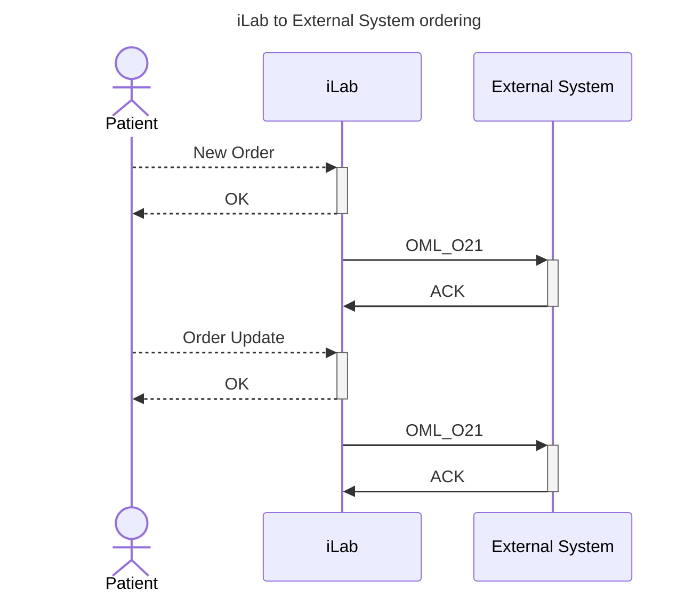

# Ordering

## Orders from LIS iLab to external system

To simplify the documentation, we will follow recommendations of [IHE](https://www.ihe.net/). The relevant IHE workflow is [Inter Laboratory Workflow (ILW)](https://wiki.ihe.net/index.php/Inter_Laboratory_Workflow). Following IHE terminology, iLab will be **Requester** and the external system will be **Subcontractor**.

As a **Requester**, LIS iLab may be configured to send orders via HL7 channel in real-time, based on the following events:

- When **order is created** in LIS iLab (this include manual registration or import from external systems)
- When **order is modified** in LIS iLab (either manually or programmatically)

LIS iLab will track already sent orders, so in case of modification it will send only required changes and will reference initially sent order. In this way, receiving party will have a real-time synchronization with iLab.

Here is the process:

